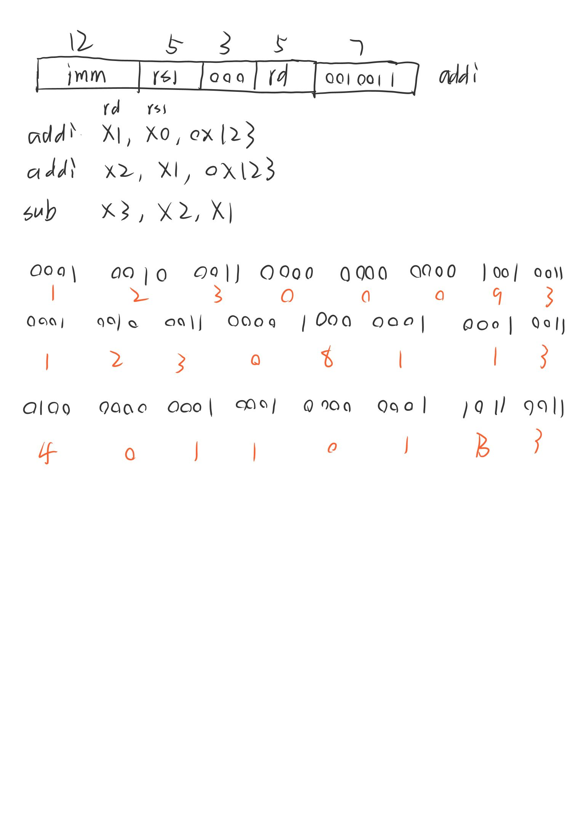
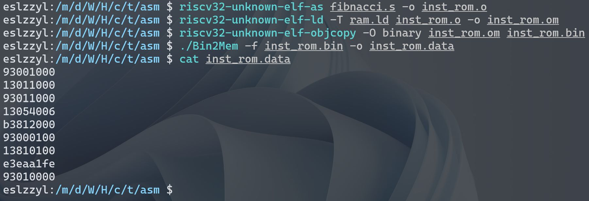
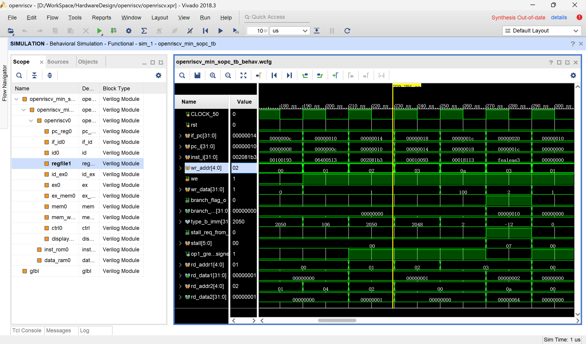
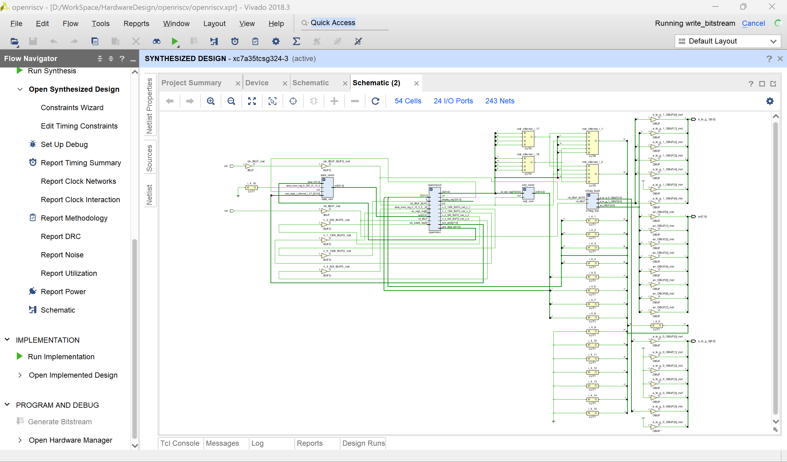
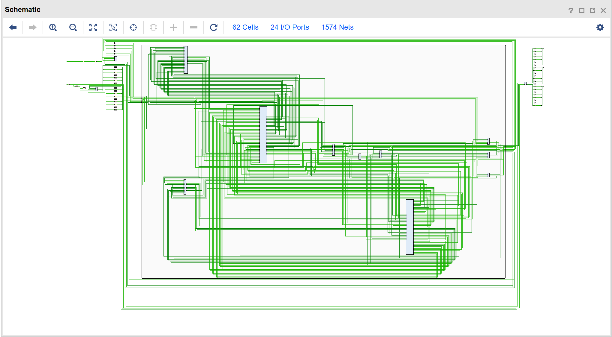
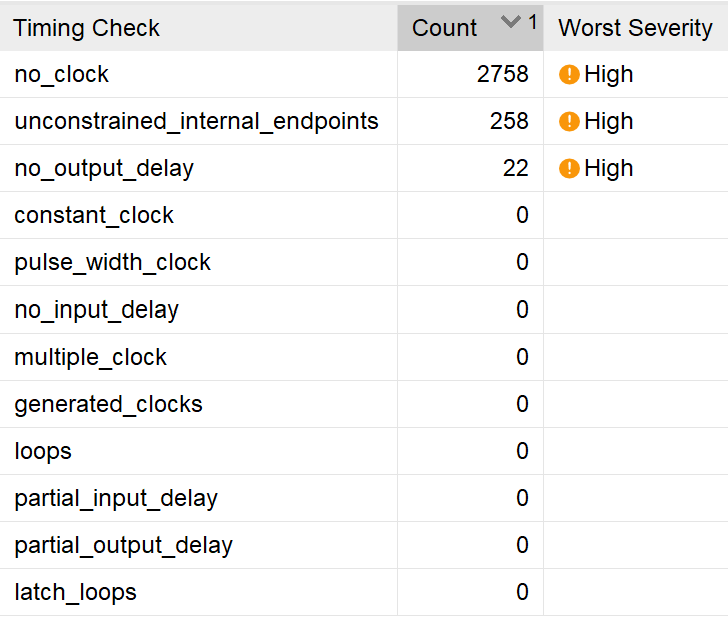

### 本组的工作概述

- RISC-V ISA，五级流水线
- 实现了RV32I基础指令集中的算术、逻辑运算指令、无条件分支指令、条件分支指令和load store指令。
- 带有数据相关检测、数据前推、流水线暂停等机制
- 设计可综合，可下载至FPGA开发板（但无法正常工作）
- 测试程序为手写RISC-V汇编，使用`riscv-gnu-toolchain`编译成二进制，固化在RTL代码中。
- 测试程序内容：推算斐波那契数列在100以内的项，并尝试通过开发板数码管显示。

### 指令实现情况

实现了如下RV32I指令：

- 无条件跳转：`jal`、`jalr`
- 条件分支：`beq`、`bne`、`blt`、`bltu`、`bge`、`bgeu`
- 逻辑运算：`ori`、`or`、`andi`、`and`、`xori`、`xor`、`slt`、`slti`、`sltiu`、`sll`、`slli`
- 算术运算：`add`、`addi`、`sub`、`sri`
- Load：`lb`、`lh`、`lw`、`lbu`、`lhu`
- Store：`sb`、`sw`、`sh`
- 杂项：`lui`、`auipc`
- 以及“空”（`nop`）指令。

合计33条指令。

### 测试程序

我们使用RISC-V汇编语言编写了如下的测试程序：

```assembly
.org 0x0
.global _start
_start:
    addi x1, x0, 0x1
    addi x2, x0, 0x1
    addi x3, x0, 0x1
    addi x10, x0, 0x64
loop:
    add x3, x1, x2
    addi x1, x2, 0x0
    addi x2, x3, 0x0
    bltu x3, x10, loop
end:
    addi x3, x0, 0x0

```

这个测试程序将会推算斐波那契数列在100以内的项，并依次写入寄存器堆的x3寄存器。

在测试的早期，我们使用手动汇编的方式来得到二进制指令，手动汇编的过程非常繁琐。下图是对三条算术指令进行手动汇编的手稿。



为了自动化汇编过程，我们自行从源代码编译安装了`riscv-gnu-toolchain`来完成汇编流程。

对上述汇编文件进行汇编、链接，并直接复制出二进制形式的指令：

```
93001000
13011000
93011000
13054006
b3812000
93000100
13810100
e3eaa1fe
93010000
```



### 仿真情况

在仿真阶段，我们将二进制指令写在一个文本文件中，仿真时通过TestBench模块调用Verilog系统函数从该文件读取指令并填充指令存储器。

在综合、下载阶段，由于综合器不支持上述系统函数，我们将二进制指令直接固化到指令存储器：

```verilog
always @(*) begin
    if (rst == `RstEnable) begin
        inst_mem[0][`InstBus] = 32'h93001000;
        inst_mem[1][`InstBus] = 32'h13011000;
        inst_mem[2][`InstBus] = 32'h93011000;
        inst_mem[3][`InstBus] = 32'h13054006;
        inst_mem[4][`InstBus] = 32'hb3812000;
        inst_mem[5][`InstBus] = 32'h93000100;
        inst_mem[6][`InstBus] = 32'h13810100;
        inst_mem[7][`InstBus] = 32'he3eaa1fe;
        inst_mem[8][`InstBus] = 32'h93010000;
    end
    ...
end
```

指令存储器在PC模块的驱动下逐条取出指令并送译码模块。

在Xilinx Vivado中运行仿真，观察`openriscv_min_sopc.openriscv.regfile`（寄存器堆）模块的写入情况，可以观察到`x3`寄存器被依次写入了斐波那契数列，说明测试程序在仿真环境下达到了预期效果。



设计早期我们使用开源的`iverilog`+`GTKWave`方案进行仿真，随着项目规模的逐渐增大，该方案的仿真时间长到难以忍受（约半小时完成一次），于是我们切换到Vivado的闭源仿真器，速度得到了显著提升（约5秒完成一次）。

### 下载到FPGA情况

之前编写的测试程序将斐波那契数列的项顺序写入x3寄存器，因此我们计划将x3寄存器的值通过数码管依次显示。

由于处理器核的速度较快，如果将x3按原速度显示出来，人眼将难以捕获。因此我们编写了一个缓冲模块，每隔若干个时钟，将缓冲的x3值送到数码管驱动电路。通过调整计数值，可以使每个值的停留时间稳定在一秒左右。


我们对**缓冲模块**和**数码管驱动模块**的组合体进行了单独的测试，显示效果符合预期（请见另一位同学的自述）。

我们也对**处理器核**和**缓冲模块**的组合体进行了仿真测试，结果表明缓冲模块可以正常缓冲来自x3寄存器的值并延时送出。


通过Xilinx Vivado对处理器核、缓冲模块和数码管驱动电路进行综合，得到电路网表如下：



其中处理器核的网表结构如下：



综合结果下载到FPGA后，我们发现数码管**无法正常显示**。表现显示固定在复位时的全0状态，没有显示斐波那契数列的项。

我们在Vivado环境下对综合结果进行硬件调试，硬件探针显示处理器核**没有**正常地将x3寄存器的值送出。据此可以推测处理器核的综合结果和仿真结果的行为是不一致的。

我们参考有关资料，尝试分析Vivado给出的时序分析报告，发现其中存在一些时序问题。



尝试按照相关文档添加时钟和时序约束，问题未能解决。

```xdc
set_property -dict { PACKAGE_PIN P17 IOSTANDARD LVCMOS33 } [get_ports {clk}]; 
create_clock -add -name sys_clk_pin -period 20.00 -waveform {0 10} [get_ports {clk}];
set_input_delay -clock sys_clk_pin 10 [get_ports rst_n]
```

### 总结

通过一段时间的设计，我们成功地实现了RV32I指令集中的大部分指令，了解了硬件设计的基本流程，并在仿真环境下通过了测试程序。我们进行了下载到FPGA的尝试，但是由于对硬件设计缺乏深入了解，没有获得预期的结果。

我们认识到：FPGA设计是一项和硬件条件密切联系的工作，在硬件设计阶段就需要谨慎地考虑电路的时序关系，否则在综合后可能无法得到预期的结果。